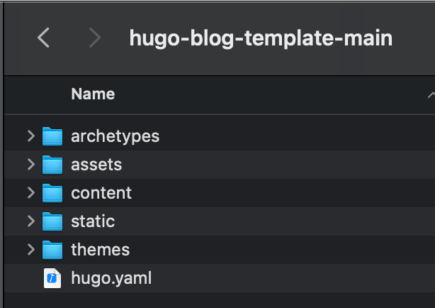
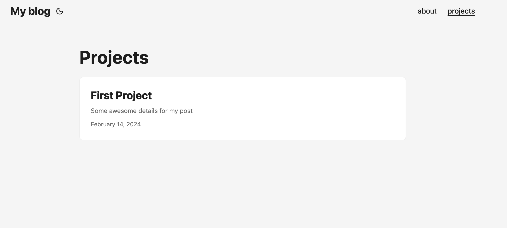
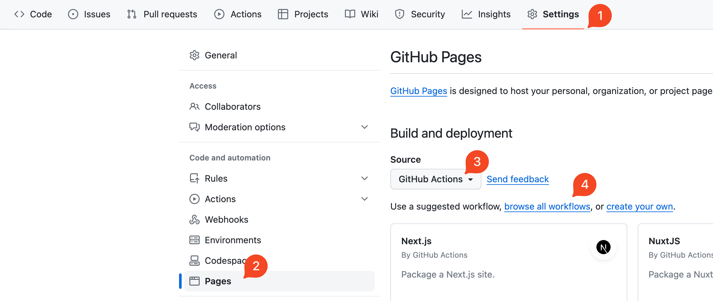
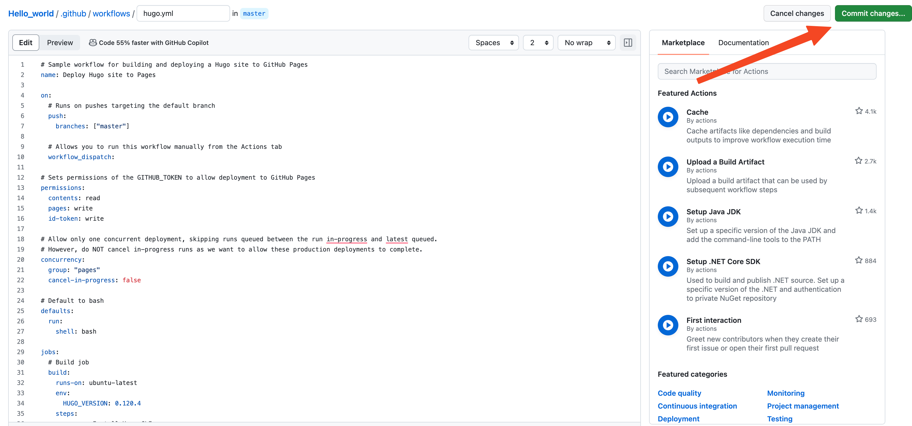

In this post, we will set up a **fast and free** personal site to showcase your resume, projects, and thoughts. Yes, you could create a react app, ticker with CSS, and set up a database to host information regarding the projects but I have taken a simpler route.

> I have taken the approach of Good enough software

Pros,

- Quick to setup
- It is free to host
- It is easy to update the information

# Let's Start

1. Setting up a Hugo site from a template
2. Setup up the GitHub pages for free hosting

## Setup Hugo Site

What is Hugo? It is a static site generator written in the Go language. More about it [here](https://gohugo.io/).

What I like about it, 

1. *It generates static sites* i.e. The content that you see on the screen is readily present in the HTML it is not fetched from the database dynamically and rendered. I like static generation of content that rarely changes I guess so does google for indexing purposes.
2. *It generates content from markdown*. I need not worry about updating my information by changing HTML or creating database records. I can easily create a markdown file Voilà there is my post.

You can quickly install it on Mac using,

```bash
brew install hugo
```

Enough selling the product. Let's create the site. You can explore Hugo and Hugo's themes. But I have created a template for you to quickly start creating your site.

### Setup

1. Download the template from [here](https://github.com/nikhil-vemula/hugo-blog-template/archive/refs/heads/main.zip)
2. Unzip it and rename the directory to whatever you want Ex. `my-blog` and open it.



3. Modify the `hugo.yaml` to change the default values in the highlighted lines below

    - Change the baseUrl to github
    - Change the name of the site
    - Change your title, subtitle and add image if you want
    - Add or change social icons

```yaml {linenos=false,hl_lines=[1, 3, "25-27", "33-35"]}
baseURL: https://git_user_name.github.io/
languageCode: en-us
title: My blog
theme: PaperMod

enableRobotsTXT: true
buildDrafts: false
buildFuture: false
buildExpired: false

menu:
  main:
    - identifier: about
      name: about
      url: /
      weight: 10
    - identifier: projects
      name: projects
      url: /projects/
      weight: 20

params:
  profileMode:
    enabled: true
    title: "John Doe"
    subtitle: "Yet another programmer"
    imageUrl: ""
    imageWidth: 120
    imageHeight: 120
    imageTitle:

  socialIcons:
    - name: github
      title: Github
      url: "https://github.com"
```
4. Time to see the changes. Run the following command to start a local server.
```bash
hugo server -D
```

```bash
......
......
Web Server is available at http://localhost:59053/ (bind address 127.0.0.1) 
Press Ctrl+C to stop
```
5. It starts the server at some ports ex. `http://localhost:59053/` as shown above, navigate to it.


6. Yippeyy. It works! but it's empty. Let's fix that.

### Add project content
Create a markdown file for your project by running the command.

```bash
hugo new content projects/first-project.md
```

2. It creates a file `content/projects/first-project.md`

3. Add some markdown text to it

```md {linenos=inline, hl_lines=[7]}
+++
title = 'First Project'
date = 2024-02-14T12:20:22-05:00
draft = false
+++

Some awesome details about my project
```

4. Tada! We added a new project to my site by simply creating a file.



5. We created the blog and added some projects. Now let's deploy it for free.

## Setup GitHub

Do you know you can host a static site for free on GitHub with cool looking URL like this [https://nikhil-vemula.github.io/](https://nikhil-vemula.github.io/)


Let's do that.

1. Create a public repository on GitHub with the name `<github_user_name`>.github.io`. Replace the `github_user_name` with your github username.
2. Go to your `my-blog` directory, replace `github_user_name` as shown below, and run the following commands.

```bash
git init
git commit -m "first commit"
git remote add origin https://github.com/<github_user_name>/<github_user_name>.github.io.git
git push -u origin master
```

3. The above commands will create a commit and push your blog to github.
4. You can verify by going to `https://github.com/<github_user_name>/<github_user_name>.github.io`

### Setup Github Pages

1. Go to the settings of the repository
2. Go to Pages
3. Change the source to `Github Actions`
4. Click on browse all workflows
5. Search for `Hugo` workflow and click on configure
Click on the `Commit`` Changes` button
7. You can check your build status under the `Actions` tab.
8. Navigate to `https://github.com/<github_user_name>/<github_user_name>.github.io`

This adds a `.github/workflows/hugo.yml` to your repository which builds your site every time there is a new commit to it.





## Summary

- We have created a new static site using Hugo and you can add more projects to showcase.
- We have hosted it using free Github Pages
- You can add more features and make it look cooler by exploring Hugo and Hugo themes.

## Advanced

- We have used the [PaperMod](https://github.com/adityatelange/hugo-PaperMod) theme for this blog there are many customization options available for it. You can check them [here](https://github.com/adityatelange/hugo-PaperMod/wiki/Features)
- Hugo is amazing. You can edit existing themes to add more features or create your theme.